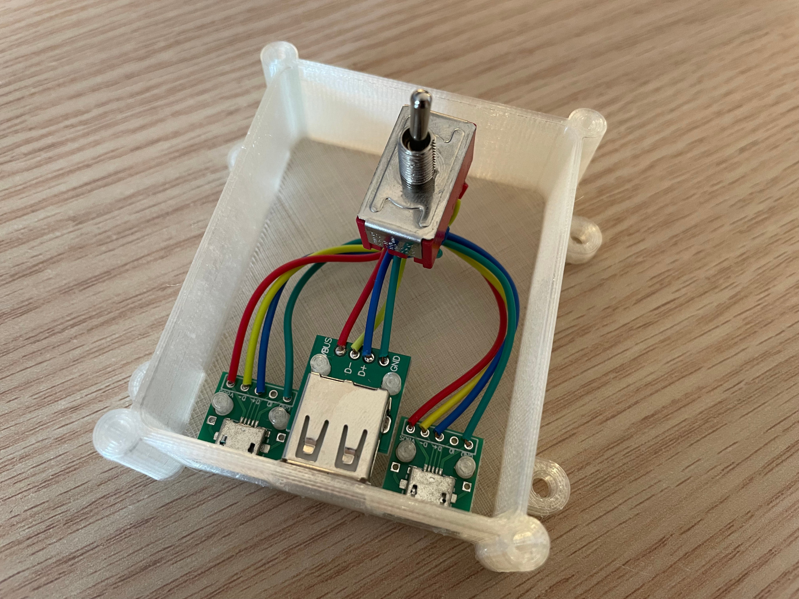
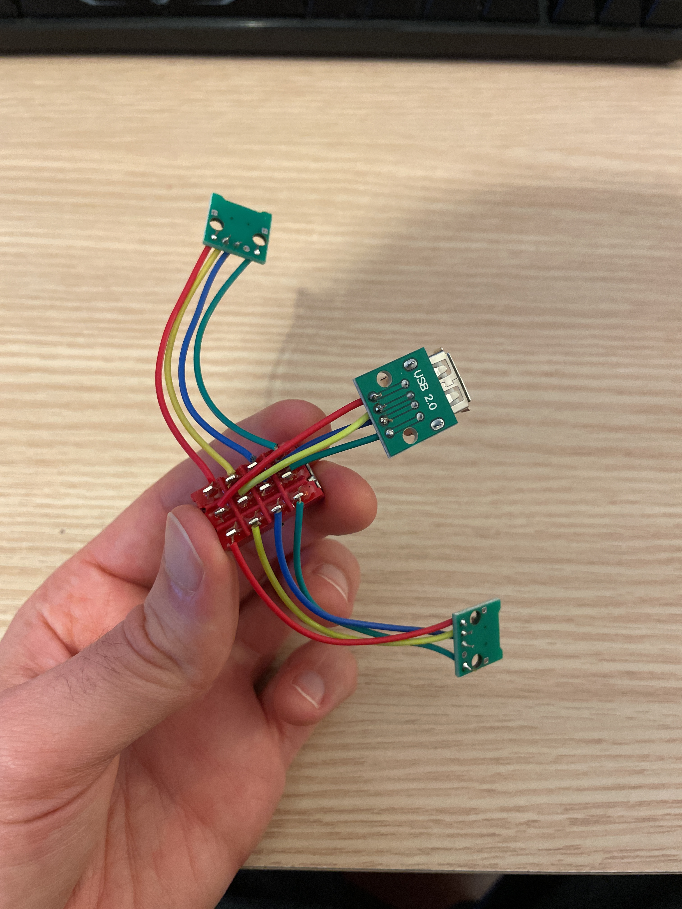
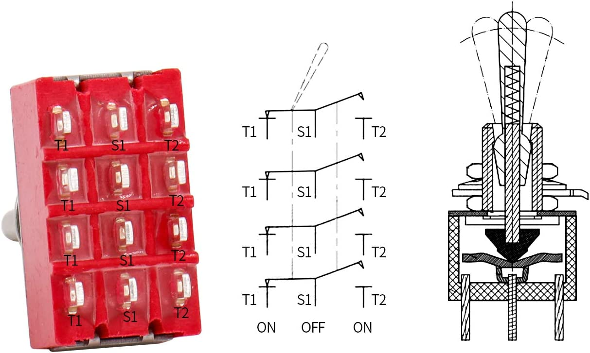

# DIY

USB switch to connect the same device to two computers

## Parts

* x2 Female micro usb
* x1 Female usb-A
* x1 4PDT 12 pins Switch
* 1m of cable

Solder each micro-usb in the left and right rows of connections, solder the usb-A in the center one.

